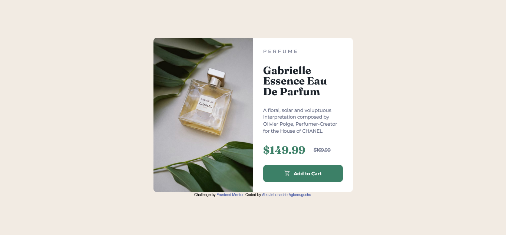
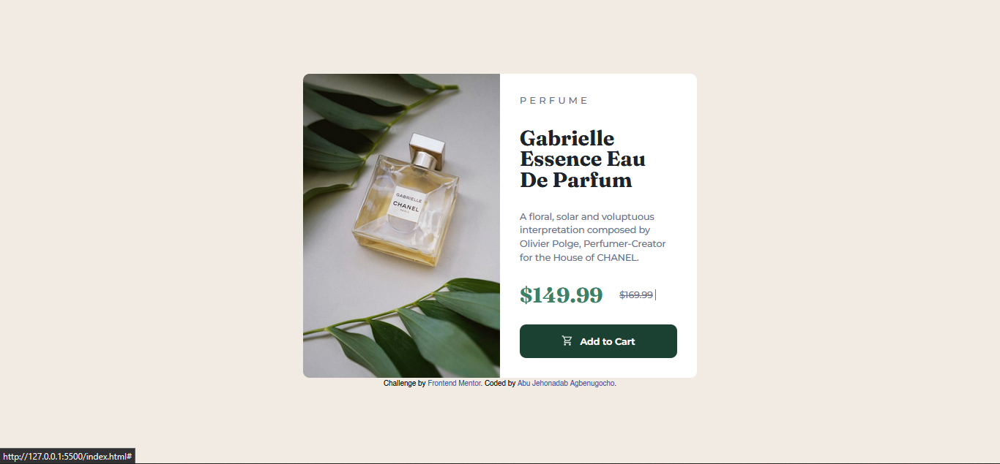
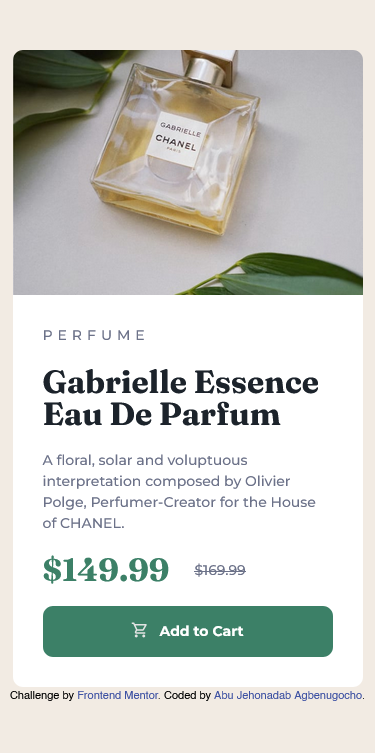

# Frontend Mentor - Product preview card component solution

This is a solution to the [Product preview card component challenge on Frontend Mentor](https://www.frontendmentor.io/challenges/product-preview-card-component-GO7UmttRfa). Frontend Mentor challenges help you improve your coding skills by building realistic projects. 

## Table of contents

- [Overview](#overview)
  - [The challenge](#the-challenge)
  - [Screenshot](#screenshot)
  - [Links](#links)
- [My process](#my-process)
  - [Built with](#built-with)
  - [What I learned](#what-i-learned)
  - [Useful resources](#useful-resources)
- [Author](#author)
- [Acknowledgments](#acknowledgments)

**Note: Delete this note and update the table of contents based on what sections you keep.**

## Overview

### The challenge

Users should be able to:

- View the optimal layout depending on their device's screen size
- See hover and focus states for interactive elements

### Screenshot





### Links

- Solution URL: [Github Repo](https://github.com/thatnadab/product-card)
- Live Site URL: [Live site](https://thatnadab.github.io/product-card/)

## My process

### Built with

- Semantic HTML5 markup
- CSS variables/custom properties
- Flexbox
- Desktop-first workflow

### What I learned

In this project I able to put my understading of CSS media queries for responsive design and CSS variables to a test. I learnt how various components of a webpage can change as the result to the size of the screen. I also learnt the importance of the of the viewport metadata 
```html
<meta name="viewport" content="width=device-width, initial-scale=1.0">
```
in the head section of the of document which is used to fetch screen sizes.

I also learn thow to use CSS variables, or custom properties, for maintaining consistent styles. Using the variables I was able to define reusable values, making updates easier. For example:
```css
:root {
  --clr-green500: hsl(158, 36%, 37%);
  --clr-green700: hsl(158, 42%, 18%);
}
```
They can be called and used like in the example below:

```css
.product-btn {
    background-color: var(--clr-green500);
    color: var(--clr-light);
}
```
Adjusting a project's design becomes effortless by changing variable values in one place, ideal for large projects or team environments.

I also learnt how to implement media queries in the product to ensure the product card is fully responsive across different screen sizes using a desktop-first approach.
Example:
```css
@media (max-width: 600px) {
    .card {
        width: 350px;
        height: auto;
        flex-direction: column;
    }
}
```

###  Useful resources
The youtube videos [Learn CSS Flexbox in easy way](https://www.youtube.com/watch?v=rPlwsRJZ_EM&t=35s&pp=ygUdTGVhcm4gQ1NTIEZsZXhib3ggaW4gZWFzeSB3YXk%3D), [Master Responsive CSS Media Queries in easy way](https://www.youtube.com/watch?v=n9yI6fjkrfE&t=30s&pp=ygUvTWFzdGVyIFJlc3BvbnNpdmUgQ1NTIE1lZGlhIFF1ZXJpZXMgaW4gZWFzeSB3YXk%3D) and [Learn CSS Variables in 7 Mins](https://www.youtube.com/watch?v=5wLrz_zUwoU&t=37s&pp=ygUdTGVhcm4gQ1NTIFZhcmlhYmxlcyBpbiA3IE1pbnM%3D) helped me understand the concepts of flexbox, media queries, and CSS variables. I highly recommend these videos for anyone trying to learn those concepts.

## Author

- Website - [Abu Jehonadab Agbenugocho](https://linktr.ee/thatnadab)
- Frontend Mentor - [@thatnadab](https://www.frontendmentor.io/profile/thatnadab)


## Acknowledgments

- Inspired by modern e-commerce product card designs.
- Created as part of the **Devcamp2025** curriculum.
- Special appreciation to [God'swill Sekav Apya](https://github.com/SekavArielight) for organizing the free bootcamp, and [Anthony Igoche](https://github.com/OdehIgoche) our Git Gurdian for the current track of the bootcamp.

Feel free to contribute or suggest improvements!